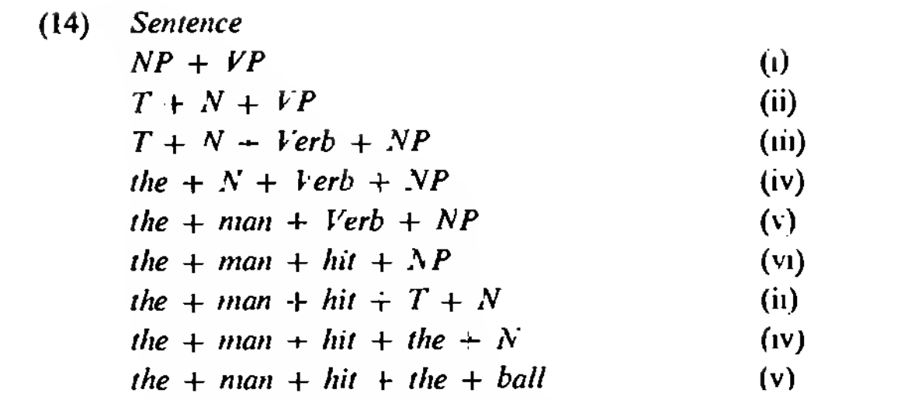

# SHA-256 String Comapre Project

[SHA-256 String Project located on Github](https://github.com/OwenRichards1/SHA-256-String-Compare)

## 1- Overview

### Aims:

The aim of this project was to develop a Java algorithm that would create syntactically correct sentences at random that could be compared using SHA-256 encoding. The goal was to output two sentences that had the highest amount of matching characters when encoded.

To achieve this, a sentence generator would insert a very diverse range of words at random into a defined sentence structure.

To accomplish the goal of finding the two hashes that were as close as possible, early iterations of the code compared two strings using a loop and the results that achieved a certain score were  outputted to the console.

The results showed that this approach was limited and it was best to move towards working with a different data structure.  Arrays were  incorporated and the generated sentences were placed into the index. Although it was a sacrifice in the speed of the algorithm it was clear that higher results were achievable from this point.

The main component required to develop was the random sentence generator. A Java class defined as 'Dictionary' would read in the available words using a text file stored locally on the machine.

### Initial Findings:

It became apparent very early on that in order to make the strings syntactically correct the nouns, verbs and adjectives would have to be inserted into a defined sentence structure. The initial sentence structure was “The noun verb the adjective.” and was modified throughout to develop the complexity of the sentences in line with higher scores being achieved.

One integral requirement of the project had been gained when developing previous algorithms and this was to first ensure that all components functioned independently. The components used were developed separately and were then incorporated one by one to ensure they all functioned together.

The code throughout the project was built out in this fashion and allowed components to be adjusted outside of the main project file and then updated when necessary changes had been made.

In terms of inserting words randomly, inspiration was drawn from the Monte Carlo Simulation and the Java Random class assisted greatly with this. To begin with, the words text file was adjusted so the first 1,000 words were nouns, the next 1,000 were verbs and the last 1,000 were adjectives. This enabled a random integer in an applicable range to return the desired word type that would fit into the sentence structure.

The initial process of comparing strings produced sentences that scored a score of 12 and above but it was very rare that the sentences, although syntactically correct, made any conceivable sense. This made it clear that further development was required in terms of the words text file and the sentence generator itself. 

Broadening the structure of the sentences was also desirable so that the sentences produced would increase the probability of a higher comparison being achieved.

## 2 - Code Structure:

While conducting research into sentence structures a number of online resources pointed towards Noam Chomsky’s “*Syntactic Structures*”. It became clear that in order to stand a better chance of the sentences making conceivable sense it would be better for them to be broken into two parts, NP & VP, which are outlined in the diagrams below.

 
=======

 

Through this, the sentence generator was separated into three smaller sections. To form a sentence an ‘assemble’ method would be called and within this an ‘NP’ and ‘VP’ method would handle the first and second half of the string independently.

This allowed for better control of the sentence structure and the methods could be adjusted on a smaller level. This also ensured that a repeated sentence was virtually impossible.

For example, at this stage the ‘NP’ section of the string always started with ‘The’. The Java Random class was incorporated and a Boolean returns true of false at random. If the Boolean returns false the start of the sentence updates to ‘A’ or ‘An’. To ensure correct grammar is followed a ‘checkNP’ method handles situations where the noun starts with a vowel and acts accordingly.

    public  static  String  getNP(Dictionary  mydictionary){
  
	    Random  rand = new  Random();
	    int  nounInt = rand.nextInt(0,586);
	    boolean  eitherOr = rand.nextBoolean();
		    if(eitherOr == true){
			    String  NP = checkNP(mydictionary.getWord(nounInt));
				    return  NP;
				   }
				   else{
					   String  NP = ("The " + mydictionary.getWord(nounInt));
					   return  NP;
					}
				}
	
	public  static  String  checkNP(String  NP){

		if(NP.charAt(0) == 'a' || NP.charAt(0) == 'A'
			|| NP.charAt(0) == 'e' || NP.charAt(0) == 'E'
				|| NP.charAt(0) == 'i' || NP.charAt(0) == 'I'
					|| NP.charAt(0) == 'o' || NP.charAt(0) == 'O'
						|| NP.charAt(0) == 'u' || NP.charAt(0) == 'U'{
							String  checkNP = new  String("An " + NP);
							return  checkNP;
						}
						else{
							String  checkNP = new  String("A " + NP);
							return  checkNP;
						}
					}

In the same way, it became clear that verbs are more likely to make conceivable sense when an ‘s’ is added to the end of them. Instead of adding an ‘s’ to every verb in the VP sentence structure the ‘checkVB’ method uses .endsWith( ) to fix this and ignores words that end with an ‘s’.

    public  static  String  getVP(Dictionary  mydictionary){
	
		Random  rand = new  Random();
		int  verbInt = rand.nextInt(587, 31388);
		int  nounInt = rand.nextInt(0,586);
		int  adjectiveInt = rand.nextInt(31389, 59867);
		
		String  verb = checkVB(mydictionary.getWord(verbInt));
		
		String  VP = new  String ( verb + " the " + 
		mydictionary.getWord(adjectiveInt) + " " +
		mydictionary.getWord(nounInt));
		return  VP;
	}
	
		public  static  String  checkVB(String  verb){
			
			if(!verb.endsWith("s")){
				String  checkVerb = new  String (verb+"s");
				return  checkVerb;
			}else  return  verb;
		}

Once the sentences started to follow these general rules adjectives were added to the VP section of the string to broaden it even further.

At this stage of development the words text file was updated to be just shy of 60,000 words and with the previously mentioned steps incorporated the algorithm started to produce examples of sentences scoring 19 and higher.

Although the introduced rules are imperfect, the sentences became a lot closer to making conceivable sense.

### Limitations:

In the first iterations of the project, the algorithm was set to compare two strings and although it ran millions of tests at a very quick speed the limitations became apparent when it very seldomly scored anything past 19.

With this in mind, the clear decision was to move towards comparing the sentences within an array. A nested for loop assisted with finding the two sentences that contained the most matches by filling two empty strings with the first and second slots of the hashes and sending them to a ‘check’ method.

If the result is higher than the previous figure, the sentence strings are updated. An If statement then assists with printing results to the console so a log of sentences can be created. It's important to note how the size of the array increases the time it takes to run the programme exponentially.

## 3 - Learning Outcomes

Some of the main points drawn from this project became evident throughout the development of the code. To begin with, the aim was to keep things simple in the early stages and to build up the code over time.

By developing the sentence generator in a separate file, breaking it into three separate components was more manageable. This allowed the ability to experiment and develop it further without impacting the main code. Once it functioned separately it was incorporated back into the main project file so tests could be run to see the results.

Through this, It became apparent that luck plays a large part in most desired outcomes of this nature but any steps and processes you can do to improve your chances are welcomed ones that can produce results.

The same can be said for the production of Bitcoin which uses similar SHA-256 comparison methods used in this project. Although having better algorithms and higher computation abilities assist the mining process, ultimately luck plays a large factor in creating a block in the Bitcoin blockchain.

To clarify, incorporating a number of random factors in the sentence structure certainly did encourage improvements. However, this meant that at times it sacrificed the likelihood of the sentences making any conceivable sense. In the experimental stages of creating sentences it was found that having two adjectives in the same sentence increased the score but also increased the likelihood of the sentence being ridiculous.

In this case it was safer to gamble with one single adjective amongst a firm structure and try hit upon a result.

As mentioned previously, once a sentence structure was established the ability to move towards higher scores was found.  This in turn, allowed experimentation with the efficiency of the algorithm. Although the move from comparing two single strings to comparing strings in an array takes a lot longer, the algorithm was more efficient in producing constant higher scores as it has more resources to pull from.

### Drawbacks:

The drawback to this however is that it takes a lot longer for the desired output to be produced and even when it is produced there is a chance that the sentences will not make any conceivable sense.

The algorithm was run over consecutive nights in hopes of a higher score being achieved but was met with sentences that was still remained unusable. In its current iteration it has been found that the algorithm is capable of producing results of 23 but have found none to be usable so far.

If the project was attempted again, a more efficient approach would be to spend a lot more time on the words text file and adjust the words within.

### Conclusions:

The two strings that scored the closest to the objective scored 22 points as they strike a balance between the sentence making the most conceivable sense and the  higher end scores the algorithm can produce over time.

